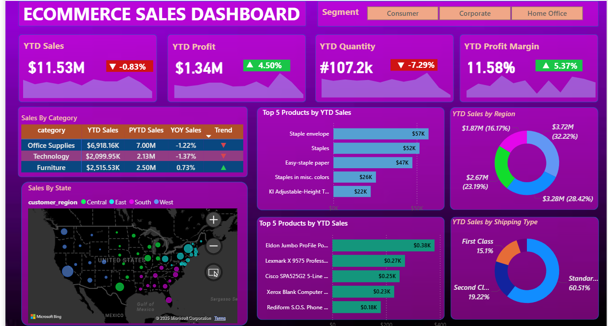
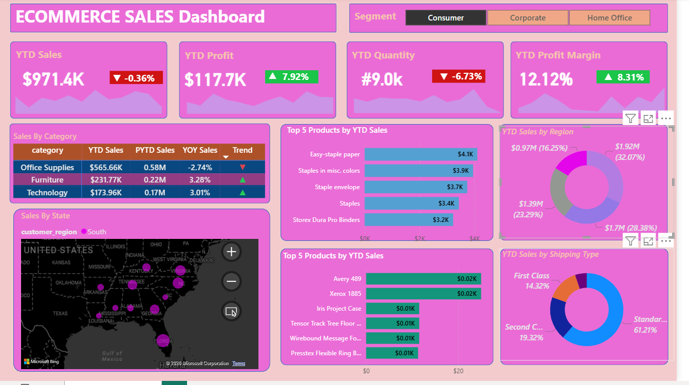
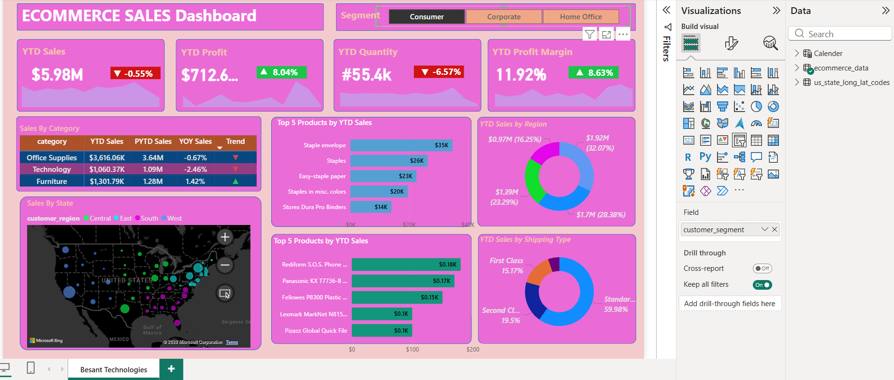

# E-Commerce Sales Analytics Dashboard (Power BI)

## Overview
This project presents an interactive Power BI dashboard built to analyze e-commerce sales data and evaluate business performance across sales, profit, quantity, regions, product categories, and customer segments.

The dashboard enables stakeholders to track key performance indicators (KPIs), identify high-performing products and regions, and understand sales trends over time.

---

## Dataset Description
The dataset contains transactional e-commerce data including:
- Order details (sales, profit, quantity)
- Product categories and sub-categories
- Customer segments
- Shipping modes
- Geographic information (regions and states)
- Time-based data for trend analysis

---

## Tools Used
- **Power BI** – Data modeling and dashboard development  
- **DAX** – KPI calculations and time-based metrics  
- **Excel** – Initial data exploration and cleaning  
- **SQL** – Data understanding and aggregation logic  

---

## Key KPIs
- Total Sales  
- Total Profit  
- Total Quantity  
- Profit Margin (%)  
- Year-to-Date (YTD) Sales, Profit, and Quantity  

---

## Dashboard Insights
- Technology category consistently generated the highest profit contribution.
- West and Central regions contributed the largest share of total sales.
- Standard shipping mode accounted for the highest order volume.
- Clear seasonal sales trends observed, with peak performance in Q4.

---

## Screenshots

---

## Skills Demonstrated
- Data cleaning and transformation
- DAX measures and calculated KPIs
- Interactive dashboard design
- Business performance analysis
- Insight-driven reporting for decision-making
